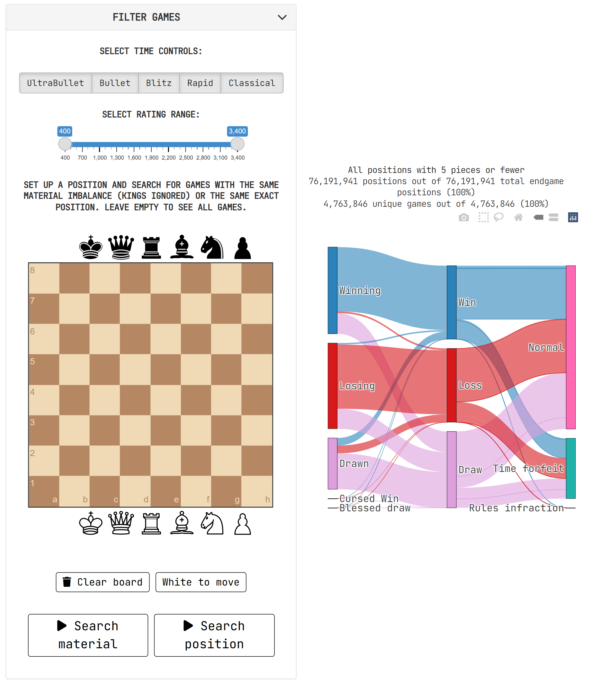

# chess.endgames
An interactive data visualization to see how tablebase positions play out in practice

Click on the image below to open the data visualization. You can filter games by time control, rating range, and by either material count or a specific FEN. Tablebase evaluations and results are always shown from white's perspective.

---

<div align="center">
  <a href="https://igorrigolon.shinyapps.io/chess_endgames/" target="_blank">
    
  </a>
</div>

---

## Introduction

Even though chess positions with 7 pieces or fewer are solved by computers, they're not always simple for humans to play correctly. I analyze over 91 million games played on [lichess](lichess.org) to answer the question:

> How often do players mess up objectively winning or drawn endgames?

Out of over 91 million games analyzed, 4.76 million of them reached a tablebase position (3-4-5 piece tablebase). That amounts to 76.2 million tablebase FENs, out of which 66.7 million are unique.

## Data

The data I used comes from the [lichess database](https://database.lichess.org/) and from [Syzygy tablebases](https://syzygy-tables.info/#download). If you just want to look at the processed data, it's all in a [GitHub release](https://github.com/IgorRigolon/chess.endgames/releases/tag/data), and in a [Google Cloud Storage bucket](https://storage.googleapis.com/chess_endgames/chess_endgames_2025-06.parquet), both stored in `.parquet`.

```
library(arrow)

dat <- open_dataset(".../chess.endgames/data/")
```

or with analogous code on Python or other languages. Just beware that the data is probably too big to load into memory all at once, which is why [Arrow](https://arrow.apache.org/) comes in handy. You'll probably want to query a subset of the data or summary statistics before running `collect()` on it to actually open it.

The data is also available in a [Google BigQuery Table](https://console.cloud.google.com/bigquery?hl=en&inv=1&invt=Ab5SZQ&project=absolute-text-417919&ws=!1m5!1m4!4m3!1sabsolute-text-417919!2schess_endgames!3schess-endgames), which I use to fuel the data visualization.

## Workflow

I manually downloaded the games played in June 2025 from the [lichess database](https://database.lichess.org/) and did three things with them: (i) I parsed the PGNs into data frames, (ii) I generated all the FENs reached in the games and checked which are tablebase positions, and (iii) I probed a locally-downloaded 3-4-5 piece [Syzygy tablebase](https://syzygy-tables.info/#download) to get the tablebase evaluations of positions. Even though I did everything in R, these last two steps relied heavily on the [`python-chess` library](https://pypi.org/project/chess/). The whole database took around a week to fully process on my weak computer.

The `process_database.R` script receives a big lichess database file and spits out the tablebase positions found within them, along with the ratings of players and the actual result of the games. Other scripts in the `/scripts/` folder are auxiliary. The output of this script is stored in `/data-raw/`, where each chunk of games is stored in a separate `.parquet` file. Once all chunks are done processing, they're written into a single Arrow dataset, split by the time control and piece count.

For the auxiliary scripts: `read_pgn.R` parses big chunks of PGNs into data frames all at once, and has a little helper function to find tablebase positions; `pgn_to_fen.R` uses `python-chess` to turn each PGN into a list of all FENs reached in the game. It is by far the biggest bottleneck, as it's relatively slow and I couldn't find a way to vectorize it: one game runs at a time. I tried to parellelize it, but it let to some bugs. `get_tablebase.R` also uses `python-chess` to take each FEN and check what a locally downloaded tablebase has to say about it.

I discarded games with a rating disparity between the players greater than 200 points, and only stored the average rating of the players. I then collapsed the ratings into bins of 100 points.

Finally, I copied the data to a Google BigQuery table so that all data processing in the Shiny App (filtering and counting positions/games) is run on the cloud. I tried other alternatives (local hosting, Google Cloud Run) and they made the graph too slow to load.

## Limitations

- Only used the games played in June 2025. Could include other and eventually all games ever, but BigQuery costs would scale proportionately;
- Did not use 6 or 7-piece tablebases;
- Data and graph are not colorblind: symmetric positions for black/white are not considered the same, and results are shown with respect to white.
